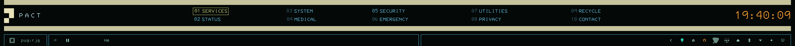
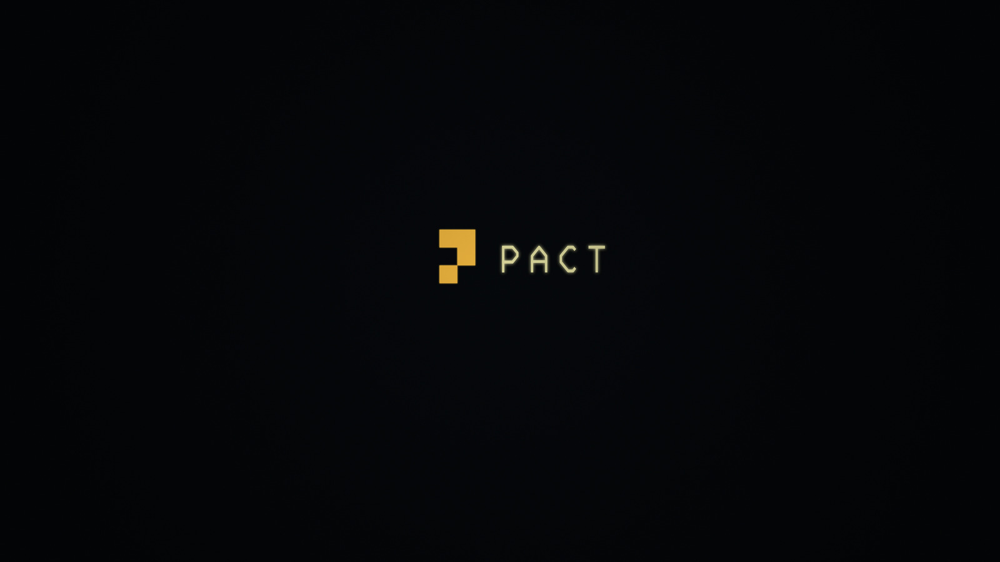
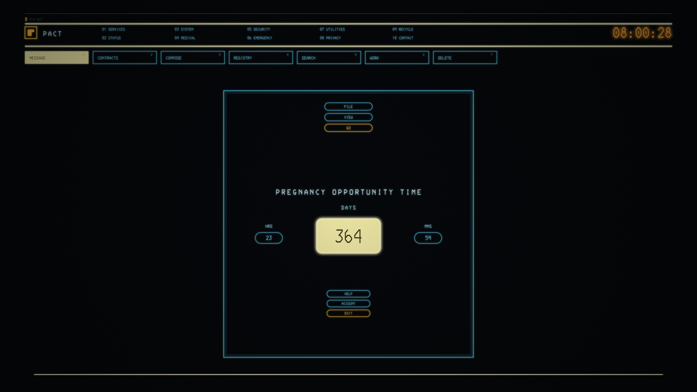

# The Pact

An [Omarchy](https://omarchy.org) theme drawn from the CRT terminals of the
silo: teal phosphor text on near-black, thin cyan frame lines, judicial
yellow-green highlights, medical yellow warnings, and PACT amber for the
things that matter.





## Install

```sh
omarchy theme install https://github.com/didlix/omarchy-theme.thepact
```

## The font

The theme is built around **IBM 3270** (`ttf-3270-nerd`, in extra):

```sh
sudo pacman -S ttf-3270-nerd
omarchy font set "3270 Nerd Font Mono"
```

3270 renders ~25% smaller than typical monospace fonts at the same point
size, which skews Omarchy's `display text size` knob (it drives shell, GTK,
and terminal sizes in lockstep). Fix it once with a fontconfig rule in
`~/.config/fontconfig/fonts.conf`:

```xml
<match target="font">
  <test name="family" compare="contains"><string>3270</string></test>
  <edit name="pixelsize" mode="assign">
    <times><name>pixelsize</name><double>1.25</double></times>
  </edit>
</match>
```

## Optional CRT effect

A static screen shader (scanlines, phosphor mask, vignette — no animation,
so Hyprland's damage tracking stays on) ships as `silo-crt.frag`. It is off
by default; enable it by uncommenting the `screen_shader` line in the
theme's `hyprland.lua`. Tuned for 5120×2880 — adjust `RESOLUTION` in the
frag for other panels.

## The PACT bar

The two-row bar in the screenshot is a separate plugin that reads this
theme's `[pact]` tokens (workspaces as numbered floors with submenus, a
boxed plugin dock, the chonky amber clock). It will be published separately
as `omarchy-plugin.pact-bar`; the theme stands alone without it.

## Design reference

`design/` carries the full 6K recreation of the PACT screen this theme is
built toward, plus editable SVG sources for the wallpapers and lock logo.



## Credits

A fan tribute to the computer terminals of *Silo* (Apple TV+). Not
affiliated with, or endorsed by, Apple or the show's producers. All artwork
here is original, built from public screenshots as reference.
